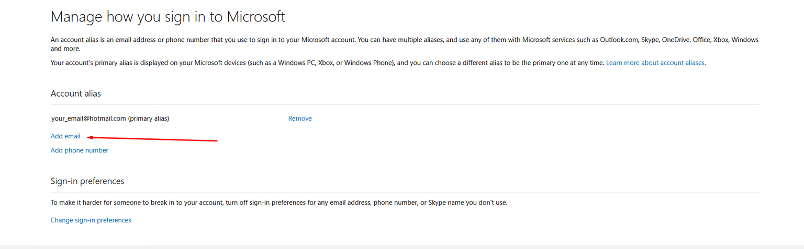
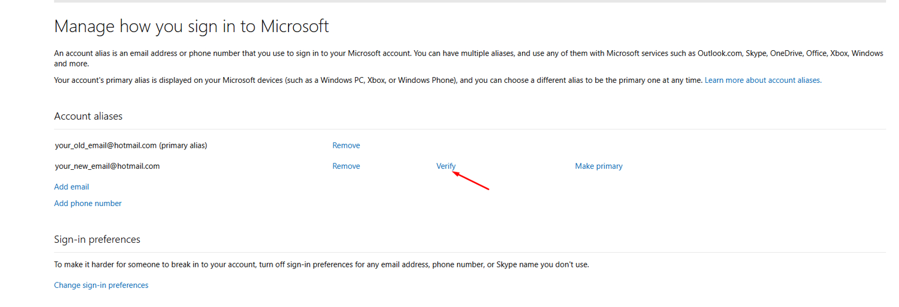
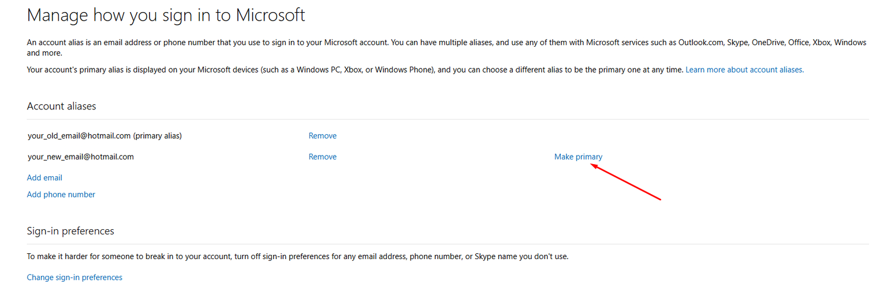

# Cambiar correo y datos

1. Ingresa al siguiente [link](https://account.live.com/names/manage?mkt=en-US\&refd=account.microsoft.com\&refp=profile).
2. Al ingresar encontraras una página similar a esta, pero en español. Debes clickear en "add email" o "añadir correo".

3. Despues de clickear en añadir correo, serás redirigido a una nueva pagina. Debes seleccionar la opción "añadir una dirección de correo existente como alias de Microsoft".

4. Clickea en "verificar". Vas a recibir un link para confirmar tu nueva dirección de correo. 

5. Clickea en "convertir principal". Es posible que no te deje y te aparezca un error. De ser así, vuelve a intentar en una semana. **¡Es importante que lo dejes como principal!**

6. Remueve todos los demas correos, solo deja el tuyo.

## Pasos importantes de seguridad

1. Ingresa al siguiente [link](https://account.live.com/proofs/manage/additional).
2. Clickea en el botón azul que dice "Agregue otra forma de iniciar sesión en su cuenta".
3. Escribe el mismo correo personal que vinculaste a la cuenta de Microsoft.
4. Recibiras un código de 6 digitos en tu correo, debes ingresarlo en la página.
5. Ahora tu correo personal recibirá codigos de seguridad. Debes quitar los demas correos para evitar que lleguen códigos a esas direcciones.
6. Baja al final de la página y genera un código de recuperación, **¡es importante que lo guardes muy bien!**
7. Cierra todas las sesiones clickeando en el botón azul que está un poco mas arriba.
8. Para mayor seguridad, se recomienda activar los 2 metodos de la sección "**Seguridad adicional**" (cuenta sin contraseña y verificación en dos pasos)
9. Vuelve a la [sección principal](../)

